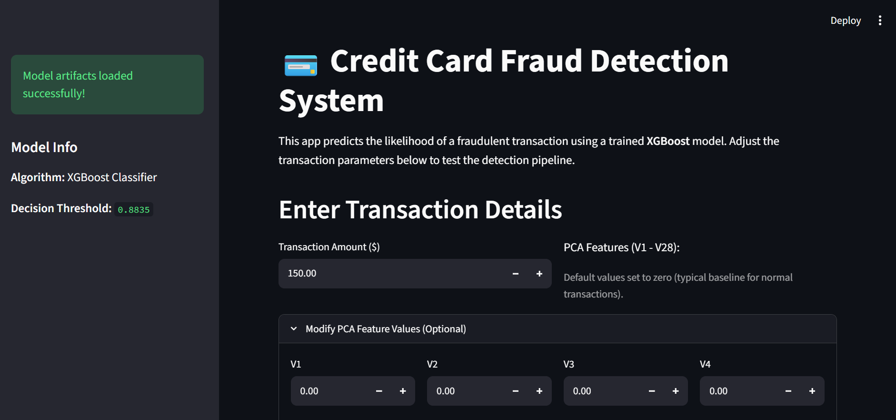
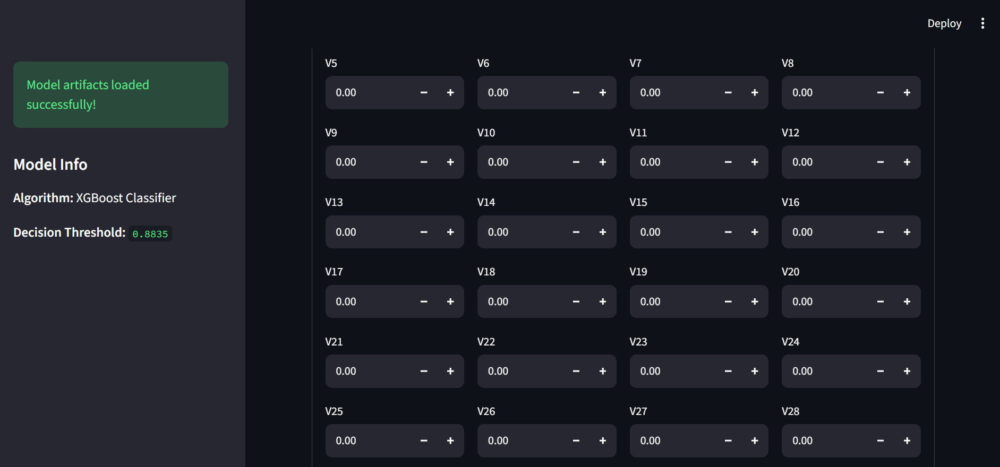
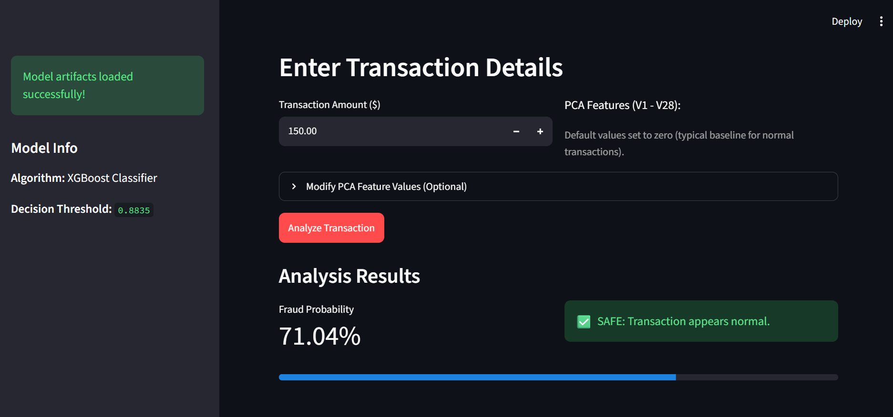

# 💳 Credit Card Fraud Detection Pipeline & Web App

An end-to-end Machine Learning system designed to identify fraudulent credit card transactions in highly imbalanced financial datasets using **XGBoost, SMOTE resampling, and classification threshold optimization**.

The project focuses on preventing data leakage, handling severe class imbalance, comparing multiple machine learning models, and optimizing fraud detection performance using precision-recall analysis.

---
## 📱 Application Interface

| 1. Main Dashboard | 2. PCA Feature Controls |
| :---: | :---: |
|  |  
|

---

### 🚨 Real-Time Fraud Detection Output


*Real-time fraud prediction displaying transaction probability powered by the tuned XGBoost classifier.*

---

## 🚀 Key Features

- **Data Leakage Prevention:** `StandardScaler` is fitted only on the training data before transforming the test data.
- **Class Imbalance Handling:** SMOTE oversampling is applied exclusively to the training dataset.
- **Model Benchmarking:** Random Forest and XGBoost are evaluated and compared using multiple classification metrics.
- **Threshold Optimization:** The XGBoost decision threshold is optimized using the Precision-Recall curve to maximize F1-score.
- **Model Evaluation:** Performance is evaluated using Precision, Recall, F1-Score, ROC-AUC, PR-AUC, and a Confusion Matrix.
- **Model Persistence:** The trained XGBoost model, scaler, and optimized threshold are serialized using Joblib.
- **Web Application:** A Streamlit interface provides an interactive way to perform fraud predictions.

---

## 🛠️ Tech Stack

- **Programming Language:** Python
- **Data Processing:** Pandas, NumPy
- **Data Visualization:** Matplotlib, Seaborn
- **Machine Learning:** Scikit-learn, XGBoost
- **Class Imbalance:** imbalanced-learn (SMOTE)
- **Model Evaluation:** Precision, Recall, F1-Score, ROC-AUC, PR-AUC
- **Web Application:** Streamlit
- **Model Serialization:** Joblib

---

## 📊 Dataset

The project uses the **Credit Card Fraud Detection** dataset containing **284,807 transactions** with 30 input features and a binary target variable.

### Features

- `Time` – Number of seconds elapsed between transactions
- `V1–V28` – Anonymized transaction features
- `Amount` – Transaction amount
- `Class` – Target variable
  - `0` → Normal transaction
  - `1` → Fraudulent transaction

The dataset is highly imbalanced, with fraudulent transactions representing only a very small fraction of all transactions.

Because of this severe class imbalance, accuracy alone is not a reliable measure of model performance. Therefore, this project focuses primarily on **Precision, Recall, F1-Score, ROC-AUC, and PR-AUC**.

---

## 🔄 Machine Learning Pipeline

The complete machine learning workflow consists of the following steps:

1. Load and inspect the credit card transaction dataset.
2. Analyze the distribution of normal and fraudulent transactions.
3. Perform a stratified train-test split.
4. Fit `StandardScaler` only on the training data.
5. Transform both training and testing data using the fitted scaler.
6. Apply SMOTE only to the training data to address class imbalance.
7. Train a Random Forest classifier.
8. Train an XGBoost classifier.
9. Compare both models using multiple evaluation metrics.
10. Generate a Precision-Recall curve for XGBoost.
11. Optimize the classification threshold using F1-score.
12. Generate predictions using the optimized threshold.
13. Evaluate the final model using a classification report and confusion matrix.
14. Analyze XGBoost feature importance.
15. Save the trained model, scaler, and optimized threshold using Joblib.
16. Use the saved artifacts in the Streamlit web application.

---

## 📈 Model Performance

The models are evaluated on the original, imbalanced test set to provide a realistic estimate of performance.

| Model | Precision | Recall | F1-Score | ROC-AUC | PR-AUC |
|---|---:|---:|---:|---:|---:|
| Random Forest | XX | XX | XX | XX | XX |
| XGBoost | XX | XX | XX | XX | XX |

> **Note:** Replace the `XX` values with the exact results produced by your notebook.

### Final Model

**XGBoost** is used as the final model based on its performance across the evaluation metrics.

The classification threshold is optimized using the Precision-Recall curve rather than relying only on the default `0.5` threshold.

**Optimal Decision Threshold:** `0.8835`

The optimized threshold is selected to maximize the F1-score and provide a better balance between detecting fraudulent transactions and minimizing false positives.

---

## 📌 Why SMOTE?

Fraudulent transactions are extremely rare compared with legitimate transactions.

If a model is trained directly on the original dataset, it may become biased toward the majority class.

To address this problem, **SMOTE (Synthetic Minority Over-sampling Technique)** is applied only to the training data.

This is important because applying SMOTE before the train-test split could introduce information from the training data into the test set and lead to **data leakage**.

---

## 📌 Why Precision, Recall and F1-Score?

Accuracy can be misleading for highly imbalanced fraud detection datasets.

For example, a model could classify almost every transaction as legitimate and still achieve very high accuracy while failing to detect many fraudulent transactions.

Therefore:

- **Precision:** Measures how many transactions predicted as fraud are actually fraudulent.
- **Recall:** Measures how many actual fraudulent transactions are successfully detected.
- **F1-Score:** Provides a balance between precision and recall.
- **ROC-AUC:** Measures the model's ability to distinguish between classes across different thresholds.
- **PR-AUC:** Particularly useful for evaluating performance on highly imbalanced datasets.

---

## 🎯 Threshold Optimization

Instead of directly using the default classification threshold of `0.5`, the project analyzes the Precision-Recall curve and evaluates different thresholds.

The threshold producing the highest F1-score is selected as the final decision boundary.

```text
Transaction
     │
     ▼
XGBoost Probability
     │
     ▼
Compare with Optimized Threshold
     │
     ├── Probability >= Threshold → 🚨 Fraud
     │
     └── Probability < Threshold  → ✅ Normal

```
## 🛠️ Project Architecture

├── models/                     # Serialized model, scaler, & threshold
│   ├── xgboost_fraud_model.pkl
│   ├── scaler.pkl
│   └── best_threshold.pkl
├── notebooks/                  # Analysis notebook
│   └── fraud_detection.ipynb
├── app.py                      # Streamlit application entry point
├── .gitignore                  # Git tracking rules
└── README.md                   # Documentation